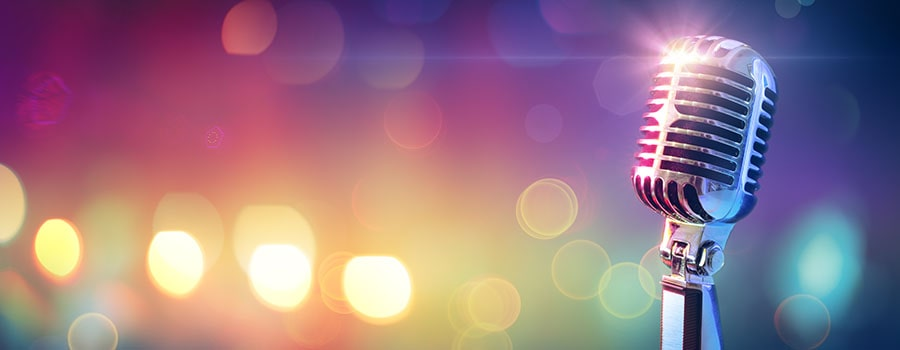

# TurnUptheData

## Team Members:

Anna Chee, Jorge Daniel Atuesta, Dan Waehner, Domenic Padulo, Nabila Rizvi

As a team we want to recognize the time and effort that Will Wright, Erin Willis and Dwight Theieme put in to help us achive our final goal. 

## Background:

Turn Up the Data Co. has hired our team of experts to get a better understanding of how music trends have been changing over the years. They want to make data-driven decisions on what types of music they should invest in as they do budget planning for the upcoming years. Using the Spotify dataset, our team will analyze how popularity of music have changed in the US based on song components and make recommendations to the company based on our findings.

## Introduction:

What are music lovers listening to nowadays? How has music changed over the years? How do the various music variables correlate to popularity of the songs, if at all? These are all valid questions to consider when planning future budgets. Our team will investigate these questions using the Spotify dataset and provide insights that will help Turn Up th Data strategize on where they should allocate their funds.

Dive into and join us in this exciting journey across data trends in the music industry!

## Final Results

Here is our teams recommendation for Turn Up The Data Co. to create the next musical hit.

Ideally the song should have the following components as a starting point:

* Acousticness should be greater than 0.5 range after a crisis. Less than 0.5 if there are no major events during that year.
* Energy should be in the from 0.6 to 0.8 range
* Instrumentalness should be in the 0.1 to 0.2 range
* Key should be in the 0.4 range
* Loudness should be in the -0.5 to 0.25 range
* Speechiness should be in the 0.2 range

As a team, we found out that there is sufficient statistical evidence that proves there is a relationship bewteen this song components and the songs popularity.

If the company decides to go with a more conservative approach (wanting their song to be in the 65% to 75% popularity ratings) they can have these starting points for the song components:

* Acousticness 0.5
* Energy 0.5
* Instrumentalness 0.08
* Key 4.7
* Loudness -9.91
* Speechiness 0.06

##### MethodAnalysis

Our team of experts 

## Results:

## Conclusion:

## Data Source:

- Kaggle Spotify datasets (https://www.kaggle.com/yamaerenay/spotify-dataset-19212020-160k-tracks)
